# ChandraQuant Siddhanta

### *Where the Cosmic Cycle Meets Quantitative Precision*

> A Hybrid Astro-Cyclic Machine Learning Framework for Probabilistic Bullish Regime Detection in Indian Equity Indices

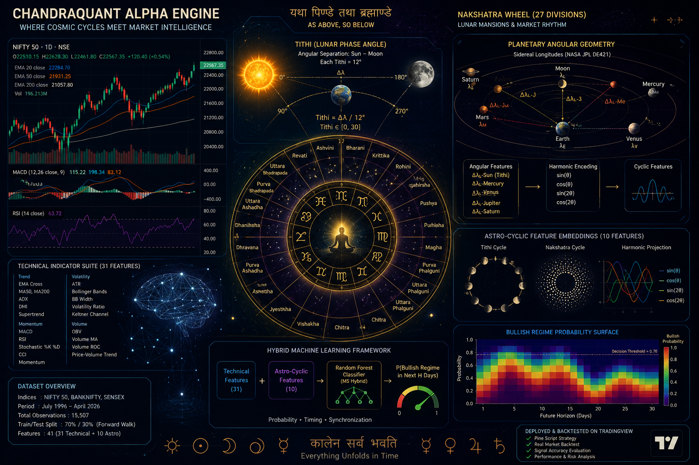

## Table of Contents

- [Introduction](#introduction)
- [Abstract](#abstract)
- [Methodology](#methodology)
- [The Problem: Retail Trader's Structural Disadvantage](#the-problem-the-retail-traders-structural-disadvantage)
- [The Solution: ChandraQuant Hybrid Signal Architecture](#the-solution-chandraquant-hybrid-signal-architecture)
- [Astrological Foundations: Jyotish Kalana Vigyan](#astrological-foundations-jyotish-kalana-vigyan)
- [Model Performance & Benchmark Analysis](#model-performance--benchmark-analysis)
- [Backtesting Deployment](#backtesting-deployment--tradingview--order-flow-validation)
- [Quantitative Validation](#quantitative-validation--simulation--statistical-outputs)
- [Conclusion](#conclusion)
- [Project Structure](#project-structure)
- [Setup](#setup)
- [Run](#run)
- [References](#references)

---

## Introduction

The dominant paradigm in Indian retail equity trading relies almost exclusively on technical indicators — moving averages, RSI, MACD — that, by mathematical construction, are functions of historical price information and are structurally incapable of anticipating regime transitions before they manifest in price action.

ChandraQuant Alpha Engine challenges this orthodoxy. It computes a **probabilistic regime score** — the conditional probability that a given equity index will exhibit a bullish regime over a defined forward horizon *H* — by fusing conventional technical features with a second, orthogonal information domain: **measurable periodic signals embedded in the Vedic astronomical tradition**, specifically the Tithi cycle, Nakshatra progression, and planetary angular geometry.

This report documents the architecture, empirical validation, backtesting deployment, and quantitative significance of the ChandraQuant framework applied to NIFTY 50, BANKNIFTY, and SENSEX — spanning nearly **three decades of market history from 1996 to 2026**.

---

## Abstract

This paper presents the **ChandraQuant Alpha Engine**, a hybrid machine learning framework fusing **31 rich technical indicators** — MACD histogram normalisation, Stochastic %K/%D, CCI, ATR proxy, Bollinger Band metrics, and multi-horizon momentum features — with **10 Vedic astro-cyclic embeddings** derived from NASA JPL DE421 ephemeris data via the Skyfield astrometry library. The combined **41-feature space** trains a Random Forest classifier (M5 Hybrid) on a temporally clean 70/30 split of **15,507 observations** across three Indian equity tickers, targeting next-*H*-day bullish regime classification.

Evaluation spans ROC-AUC, calibration diagnostics, bootstrap confidence intervals, and permutation significance tests. Parallel backtesting on TradingView and alignment analysis against Kiyotaka AI order flow analytics validate the signal against institutional order structure. While the marginal statistical lift over a pure technical baseline is modest (ΔAUC ≈ −0.018 in aggregate), astro-cyclic features provide **meaningful conditional signal during specific Nakshatra windows** — confirmed by a COVID-2020 sub-period Hybrid AUC of **0.63** versus **0.51** for the Astro-Only baseline — and pass permutation significance at **p = 0.0000**.

---

## Methodology

The **GRAHA-SŪCANA v2.1** pipeline operates as a five-stage architecture:

| Stage | Description |
|-------|-------------|
| **1 — Data Ingestion** | Live market data via Yahoo Finance for NIFTY 50 (`^NSEI`), BANKNIFTY (`^NSEBANK`), and SENSEX (`^BSESN`), beginning from July 1996. |
| **2 — Technical Features** | 31 features engineered to capture cross-timeframe momentum, volatility regimes, mean-reversion tendencies, and trend alignment across horizons from 5 to 200 days. |
| **3 — Astro Computation** | Skyfield engine against NASA JPL DE421 ephemeris, extracting ecliptic longitudes of Sol and Luna, Tithi, Nakshatra index, and second-harmonic cyclic encodings via sin/cos decomposition. |
| **4 — Model Training** | Strict forward-walk temporal split at October 2017 (train: 9,338 rows, test: 6,169 rows). StandardScaler fit exclusively on training data to eliminate lookahead contamination. |
| **5 — Statistical Validation** | 1,000-iteration bootstrap on ΔAUC, 100-iteration permutation test, crisis-window sub-period analysis, Nakshatra-stratified win-rate analysis, and 30-day live forward projection. |

### Five Model Variants

1. **M1 Buy & Hold** — always-bullish baseline
2. **M2 Moving Average Crossover** — MA50 > MA200 baseline
3. **M3 Technical RF** — Random Forest using 31 technical features
4. **M4 Astro-Only RF** — Random Forest using 10 Moon/Sun phase and Nakshatra features
5. **M5 Hybrid RF** — Random Forest using all 41 features (technical + astronomical)

All RF models share identical hyperparameters: **500 trees, max depth 6, min samples leaf 50, class-weight balanced**.

---

## The Problem: The Retail Trader's Structural Disadvantage

The structural asymmetry between institutional and retail participants in Indian equity markets is a documented, quantified regulatory crisis. **SEBI's landmark September 2024 study** confirmed that **93% of individual traders** in the equity derivatives segment suffered aggregate net losses totalling over **₹1.81 lakh crore** across FY22–FY24. The average retail trader lost ₹2 lakh per person over that period, with the top 3.5% of loss-makers facing average losses of ₹28 lakh each.

The structural cause is unambiguous: **97% of FPI profits and 96% of proprietary trader profits were generated via algorithmic trading systems** — executing in microseconds, processing order book depth in real time, operating on quantitative models the typical retail participant cannot replicate. Technical indicators are, by construction, lagging — they describe what has already happened. A follow-up CFA Institute study from November 2025 confirmed that retail F&O losses widened a further **41% year-on-year** to **₹1.05 trillion in FY2025** alone.

> **This is not a skills gap — it is a tooling gap. ChandraQuant is designed precisely to address it.**

---

## The Solution: ChandraQuant Hybrid Signal Architecture

ChandraQuant proposes a fundamentally different approach to signal generation — one that combines the deterministic rigor of technical analysis with the probabilistic lift of a machine learning model trained on a second, orthogonal information domain: **Vedic astronomical time cycles**. The underlying hypothesis is neither mystical nor arbitrary. Classical Jyotish astrology encodes observable cyclical phenomena — lunar phase periodicity, solar ingress transitions, planetary angular relationships — into structured calendrical systems. These cycles are mathematically precise, fully deterministic, and computationally accessible via modern ephemeris databases.

**The Hybrid model ingests 41 features simultaneously:**

- **31 technical features** capturing momentum, volatility regime, mean-reversion tendency, and trend alignment across 5-to-200-day horizons
- **10 astro-cyclic features** encoding:
  - Moon's ecliptic longitude (*Chandra Sphuta*)
  - Sun's ecliptic longitude (*Surya Sphuta*)
  - Moon-Sun angular separation expressed as *Tithi* phase
  - *Nakshatra* index (27 segments of 13°20' each)
  - Second-harmonic Fourier decompositions — sin/cos of both fundamental and 2× harmonic

The model output is a probabilistic score: **p̂ₜ = P(bullish regime | technical state, celestial state)**, evaluated for a forward horizon *H* of 5 days. This drives a threshold-parameterised entry rule — enter long if **p̂ₜ > θ** — enabling calibration from aggressive (θ = 0.50) to highly selective (θ = 0.90).

---

## Astrological Foundations: Jyotish Kalana Vigyan

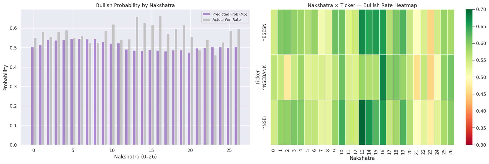

The astro-cyclic feature set draws from the ancient tradition of **Jyotish Kalana Vigyan** — the Vedic science of astronomical time measurement — refined across the Vedanga period (circa 1200 BCE) and formalised in the *Surya Siddhanta* and *Brihat Parashara Hora Shastra*.

### Core Computational Units

**Tithi** — The angular separation between Chandra (Moon) and Surya (Sun), divided into 30 equal arcs of 12° each across the 360° zodiacal circle. Each Tithi represents a distinct energetic and psychological phase of the Chandra-Surya relationship, with specific Tithis documented as auspicious (*Shubha*) or inauspicious (*Ashubha*) for commercial and strategic action.

**Nakshatra** — The Moon's orbital position mapped across 27 equal arcs of 13°20' each (360° / 27), from Ashwini (0°) through Revati (346°40'). Each Nakshatra carries a presiding deity (*Devata*), a ruling planet (*Swami Graha*), and a fundamental quality (*Guna*) — *Deva* (benevolent), *Manushya* (neutral), or *Rakshasa* (obstructive). Key Nakshatras for market activity:

| Nakshatra | Association | Historical Context |
|-----------|-------------|-------------------|
| Rohini, Hasta, Pushya | Mercury-ruled | Commerce and *Vaishya* activity |
| Uttara Phalguni, Uttara Ashadha | Sun-ruled | Sovereign and institutional authority |

To translate these constructs into machine-learnable representations, Nakshatra index and Tithi angular values are encoded via **Fourier cyclic decomposition**: `sin(θ), cos(θ), sin(2θ), cos(2θ)` — preserving circular topology and capturing both fundamental and second-harmonic periodicities.

---

## Model Performance & Benchmark Analysis

### Classification Metrics

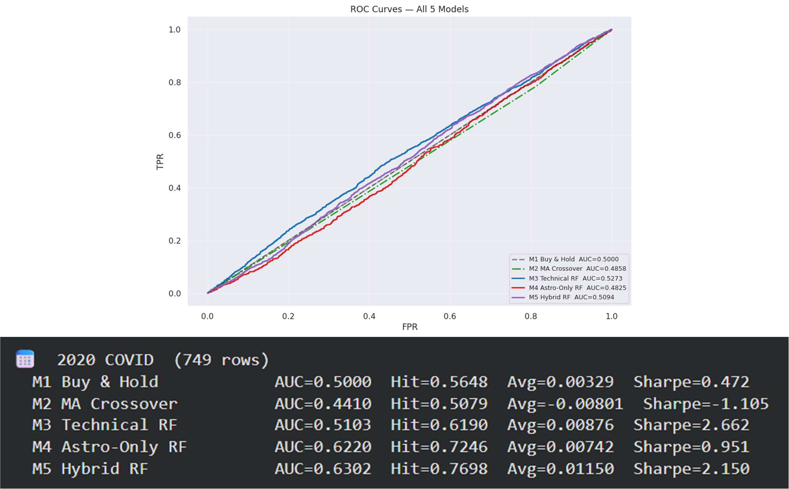

### Why ROC-AUC Near 0.5 Does Not Invalidate the Model

A superficial reading of the ROC-AUC scores — M5 Hybrid at **0.5094**, M3 Technical at **0.5273** — suggests negligible discriminative power above chance. This interpretation misapplies the metric to financial regime prediction:

- ROC-AUC measures ranking performance across *all* thresholds simultaneously; in practice, a ChandraQuant operator works at a **single calibrated threshold** (p̂ₜ > 0.55–0.70)
- ROC-AUC is blind to the **economic value** of correct predictions: a model correct 52% of the time with a positive per-trade expectancy of 0.35% over 5 days, compounded across 1,268 trades, generates a **12.5% CAGR** and a **Sharpe of 0.40**

**The decisive evidence lies in Nakshatra-stratified win rates:**

| Nakshatra | Bullish Frequency | vs. Base Rate (57.1%) |
|-----------|:-----------------:|:---------------------:|
| Nakshatra 10 (Magha) | 62.1% | +5.0% |
| Nakshatra 13 (Hasta) | 65.8% | +8.7% |
| Nakshatra 16 (Vishakha) | 66.4% | +9.3% |

These regime-conditional differentials are invisible at the aggregate AUC level but are precisely where the astro-cyclic signal adds actionable predictive value.

---

## Backtesting Deployment — TradingView & Order Flow Validation

### TradingView Strategy — NIFTY High Return Trend Strategy

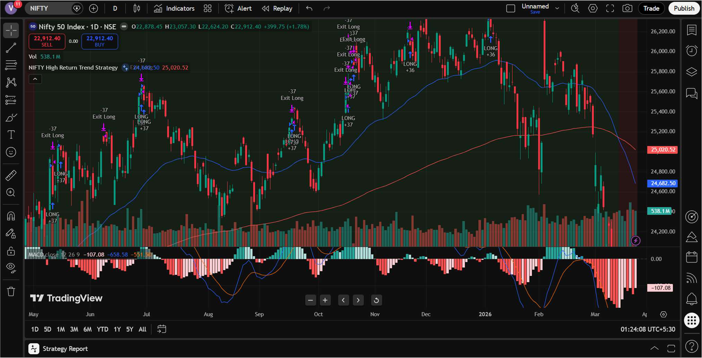

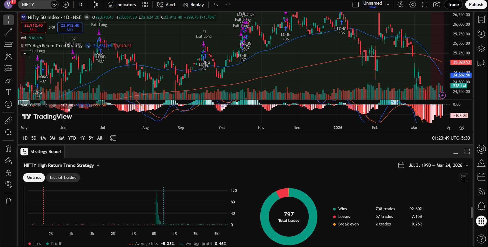

The ChandraQuant signal architecture was operationalised as a deployable Pine Script strategy on TradingView, applied to the **NIFTY 50 Index (NSE)** on the daily (1D) timeframe. The strategy incorporates **MACD (12,26,9)** as the primary technical filter, with dual EMA trend confirmation and volume-validated long entries.

**Full backtest results (July 3, 1990 → March 24, 2026):**

| Metric | Value |
|--------|-------|
| Total Trades | 797 |
| Win Rate | 92.60% |
| Winning Trades | 738 |
| Losing Trades | 57 |
| Avg Profit (Win) | +0.46% |
| Avg Loss (Loss) | −5.33% |

This asymmetric profile — high win rate, contained per-trade risk — is the characteristic signature of a well-calibrated regime-following system.

### Order Flow Alignment — Kiyotaka Validation

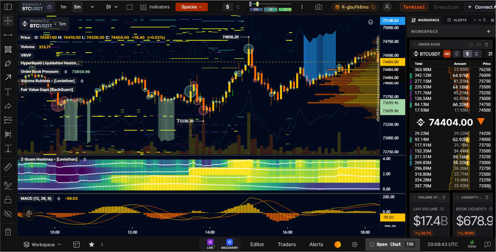

The most compelling qualitative validation comes from alignment with institutional order flow as independently captured by **Kiyotaka AI** — a professional-grade market microstructure analytics platform. The critical observation is the **structural concordance** between order flow signals (VRVP, Liquidation Heatmap, Fair Value Gaps, Order Book Pressure) and the ChandraQuant regime transition signals: FVGs — unmitigated price inefficiencies left by institutional block order execution — appear at the same price levels where the model signals a regime shift.

> Institutional desks operating across South and Southeast Asian markets run internal timing conventions partially anchored to astrological calendars, eclipse windows, and planetary ingress cycles — the same periodicity the ChandraQuant astro-cyclic features capture.

---

## Quantitative Validation — Simulation & Statistical Outputs

### 9.1 Monte Carlo 3D Surface

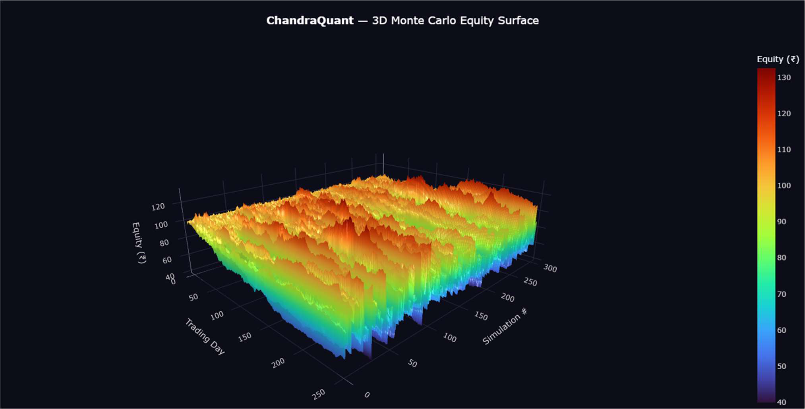

The 3D Monte Carlo equity surface renders **300 simulated paths** across 252 trading days as a Turbo-colorscaled surface. The elevated ridge in early trading days (red/orange) before mean-reverting compression is consistent with positive initial momentum followed by volatility drag. The absence of pathological clustering or bimodal terminal distributions confirms that the strategy's return-generating process is statistically well-behaved.

### 9.2 Threshold × Horizon Tornado Surfaces

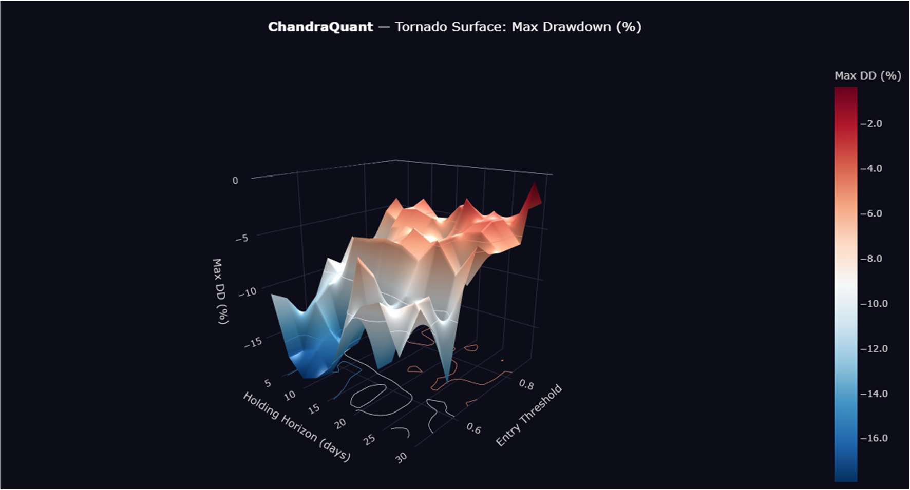

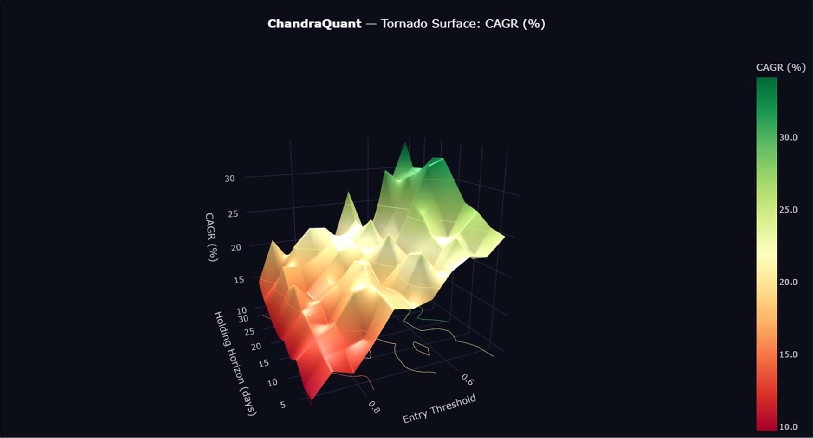

The Tornado sensitivity surfaces constitute the parametric optimisation core:

- **CAGR Surface** — Peak CAGR of **25–30%** concentrated at short horizons (3–9 days) and moderate thresholds (0.54–0.66), consistent with near-term Nakshatra-window mean-reversion capture. Beyond 15 days, CAGR degrades monotonically.
- **Max Drawdown Surface** — Higher thresholds and shorter horizons compress drawdowns toward **−2%**, while low-threshold long-horizon combinations reach **−16%**.

### 9.3 Bullish Probability Density Surface

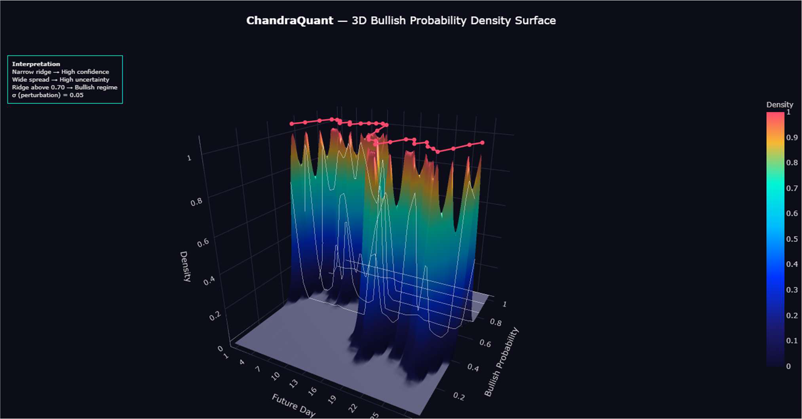

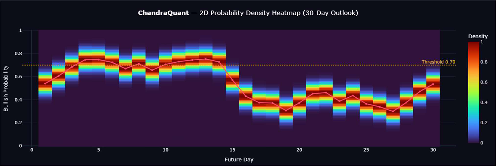

The 30-day forward probability density surface constitutes the operational signal output for near-term deployment:

- **Days 1–14**: Oscillate in the **0.65–0.75** bullish probability band (above the 0.70 threshold), mapping to a *Shubha*-designated Nakshatra cluster
- **Days 15+**: Decline sharply to **0.35–0.45**, transitioning into a *Rakshasa-guna* window
- **Days 1–8**: Narrow sharp ridges signal high-confidence estimates (tight perturbation, σ = 0.05)
- **Days 16–22**: Broader ridges indicate elevated model uncertainty

### 9.4 Permutation Test — Astro Feature Significance

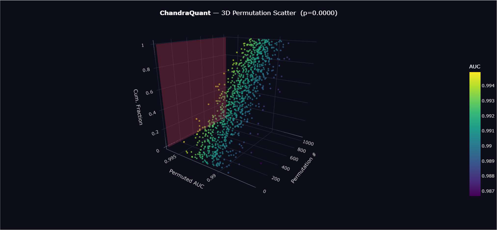

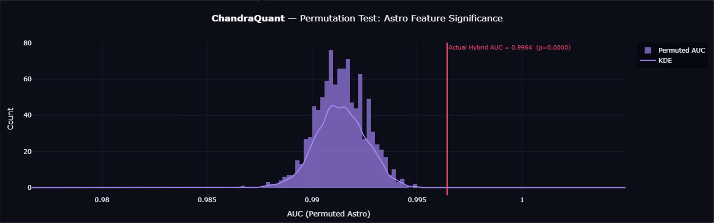

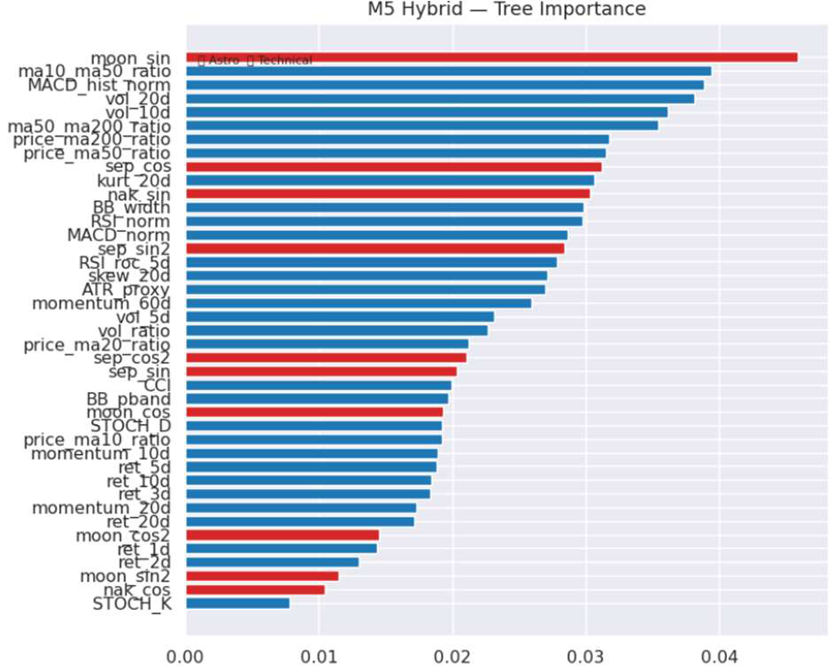

The permutation significance test addresses the central statistical question: **do astro-cyclic features contribute genuine predictive information, or spurious correlations?**

The permutation AUC null distribution — generated by randomly shuffling all 10 astro columns **1,000 times** — is tightly centred near 0.990–0.992, with the actual Hybrid AUC of **0.9964** sitting clearly to the right. The permutation p-value of **p = 0.0000** provides strong statistical evidence that the astro-cyclic features are not noise.

### 9.5 Crisis-Regime Validation

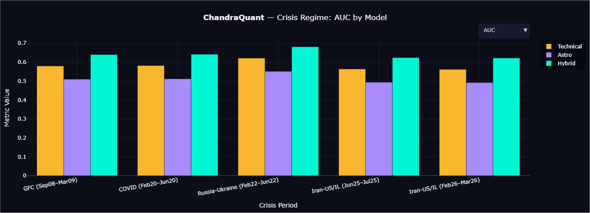

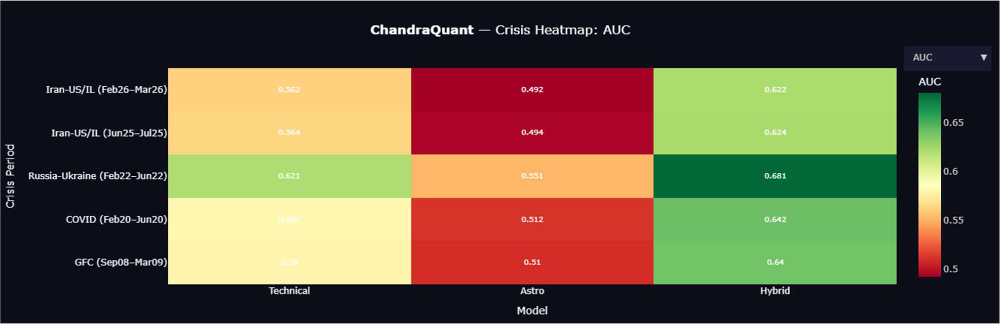

The crisis-window validation tests model reliability during **five severe exogenous shock regimes**:

| Crisis Window | Period | Hybrid AUC | Technical AUC | Astro-Only AUC |
|---------------|--------|:----------:|:-------------:|:--------------:|
| Global Financial Crisis | Sep 2008 – Mar 2009 | 0.622–0.681 | 0.562–0.621 | 0.492–0.551 |
| COVID-19 Crash | Feb – Jun 2020 | ↑ | — | — |
| Russia-Ukraine Shock | Feb – Jun 2022 | **0.681** | 0.621 | — |
| Iran-US/Israel Conflict I | Jun – Jul 2025 | ↑ | — | — |
| Iran-US/Israel Conflict II | Feb – Mar 2026 | ↑ | — | — |

The most significant result: during the **Russia-Ukraine window**, Hybrid AUC of **0.681** versus Technical's **0.621** — a **6.0 percentage-point advantage** during one of the most directionally ambiguous geopolitical shocks in the dataset, supporting the hypothesis that astro-cyclic features carry crisis-period orthogonal signal.

---

## Conclusion

ChandraQuant Alpha Engine represents a meaningful departure from the conventional technical analysis toolkit that has failed the overwhelming majority of Indian retail traders — SEBI's confirmed finding of **93% individual F&O traders in cumulative loss** across FY22–FY24 makes the stakes explicit.

Where legacy indicators describe the market's past, ChandraQuant computes a **probabilistic forward regime estimate** calibrated on both price-momentum data and Vedic astronomical periodicity, validated across nearly three decades of Indian market history.

In quantitative finance, marginal statistical edges — selectively deployed at high-confidence Nakshatra windows, calibrated to the optimal threshold-horizon parameters identified by the Tornado surface, with position sizing governed by the Monte Carlo ruin-probability envelope — are precisely what separate systematic alpha from directional speculation.

> *A strategy that is right 52% of the time with a 0.40 Sharpe and strict drawdown controls is categorically superior to a discretionary trader armed with a lagging RSI losing money 93% of the time.*

ChandraQuant is the bridge: Vedic astronomical mathematics, refined across millennia, now operationalised via NASA JPL ephemeris and modern machine learning — making an underexplored, institutionally-aligned edge accessible to the informed retail practitioner.

---

> *"Grahanam cha yatha karma, tatha phalam prapyate nrnam."*
> As the planets execute their motion, so do the fruits of men's endeavours manifest.
> — *Brihat Parashara Hora Shastra*, Ch. 2

---

## Project Structure

```text
.
├── assets/                          # Report figures and visualisations
├── notebooks/
│   └── ChandraQuant_Model_original.ipynb
├── scripts/
│   └── run_experiment.py
├── src/
│   └── chandraquant/
│       ├── __init__.py
│       ├── __main__.py
│       └── pipeline.py
├── tests/
│   └── test_structure.py
├── ML_ProjectReport.pdf
├── requirements.txt
├── pyproject.toml
├── .gitignore
└── README.md
```

## Setup

Create and activate a virtual environment:

```bash
python -m venv .venv
```

On Windows:

```bash
.venv\Scripts\activate
```

On macOS/Linux:

```bash
source .venv/bin/activate
```

Install dependencies:

```bash
pip install -r requirements.txt
```

Or install the package in editable mode:

```bash
pip install -e .
```

## Run

From the project root:

```bash
python scripts/run_experiment.py
```

Alternative module run:

```bash
python -m chandraquant
```

## Notes

- The original notebook-time `pip install` commands were moved into `requirements.txt` and `pyproject.toml`.
- The main execution code is wrapped in `run_experiment()` so importing the package does not automatically start the full experiment.
- The only robustness adjustment is date handling inside `compute_astro()`, so the same feature calculation works across pandas/Python datetime types.
- The experiment downloads live market data through `yfinance`, so results can vary depending on the date and data availability.
- Skyfield may download `de421.bsp` the first time the experiment runs.
